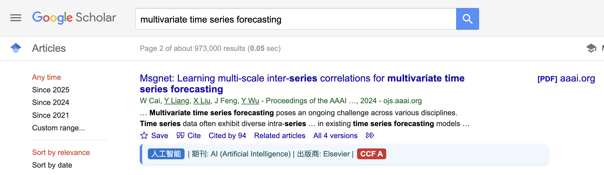

# Scholar CCF Helper

Scholar CCF Helper 是一个Chrome扩展程序，为谷歌学术搜索增加两个实用功能：
1. 自动识别并显示论文的CCF分类信息
2. 提供AI辅助搜索功能，帮助生成专业的搜索关键词

## 功能特点

### CCF分类信息显示
- 自动识别论文的发表会议或期刊
- 显示对应的CCF分类信息（专业方向分类、等级等）
- 使用醒目的样式标注不同等级（A/B/C级）
- 支持国内外主流计算机科学领域期刊会议

### AI辅助搜索
- 通过悬浮窗口提供AI搜索建议
- 使用OpenAI的接口（如GPT-4）生成专业搜索关键词
- 支持自定义系统提示词
- 可直接点击建议的关键词组合进行搜索

## 安装方法

### 开发者模式安装
1. 克隆或下载本仓库到本地
2. 打开Chrome浏览器，访问 `chrome://extensions/`
3. 开启右上角的"开发者模式"
4. 点击"加载已解压的扩展程序"
5. 选择本仓库的目录

## 配置说明

首次使用时，需要进行以下配置：

1. 点击Chrome工具栏中的Scholar CCF Helper图标
2. 填写以下信息：
   - OpenAI API Key: 您的OpenAI API密钥
   - API Base URL: API基础URL（默认为`https://api.openai.com/v1`）
   - 模型ID: 使用的模型（如`gpt-4o`）
   - 系统提示: 指导AI生成搜索建议的系统提示词

## 效果展示

## 使用方法

### CCF分类信息查看
1. 访问谷歌学术搜索（Google Scholar）
2. 搜索论文
3. 查看搜索结果，每篇论文下方如果有CCF分类，会显示对应信息
4. 不同的CCF等级会以不同的颜色标注：
   - A级：红色
   - B级：橙色
   - C级：绿色

### AI辅助搜索
1. 在谷歌学术页面，点击右下角的"AI"浮动按钮
2. 在弹出的窗口中，描述您要研究的内容或问题
3. 点击"获取搜索建议"按钮
4. 系统会生成1-3组专业搜索关键词
5. 点击任一组关键词，系统会自动使用该关键词在谷歌学术中搜索

## 文件结构

- `manifest.json`: 插件配置文件
- `popup.html`/`popup.js`: 设置页面
- `content.js`: 主要功能实现
- `styles.css`: 样式文件
- `background.js`: 后台脚本
- `ccf_categories.json`: CCF分类数据

## 注意事项

- 本插件仅识别CCF目录中收录的期刊和会议
- AI辅助搜索功能需要有效的OpenAI API密钥
- 插件默认使用GPT-4o模型，可根据需要更改

## 隐私说明

- 本插件不会收集任何个人数据
- API密钥仅存储在本地浏览器中
- 查询内容仅用于向OpenAI API发送请求
